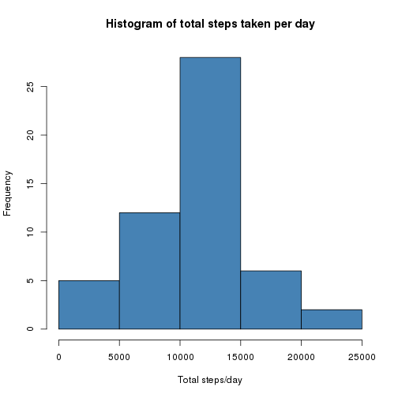
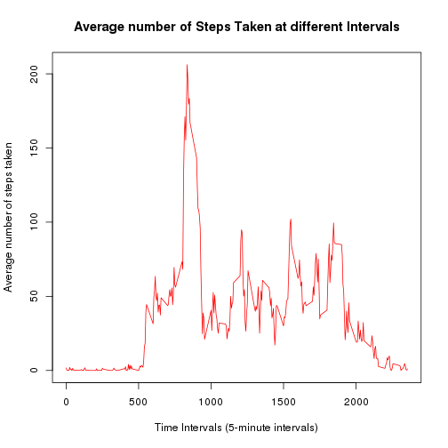
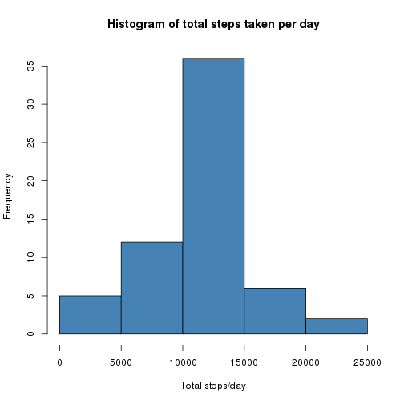
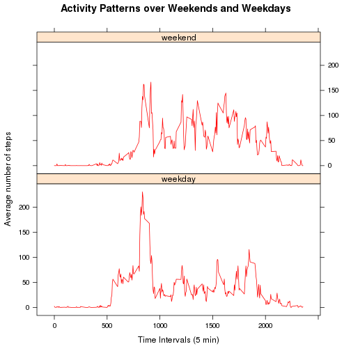

# Reproducible Research: Peer Assessment 1


## Loading and preprocessing the data
* The data is loaded in the assumption that it is present in the data folder as activity.csv
* There are 3 columns: steps, date and interval  for which the classes numeric,date
and numeric are assumed while loading.
* This style of loading assumes a linux like directory structure,
 syntax would differ if loading on windows.

```r
  inp_data <- read.csv("data/activity.csv",colClasses=c("numeric","Date","numeric"))
```


## Mean total number of steps taken per day
### Creating a histogram for total number of Steps taken per day
The following procedure is followed to create the histogram.  
* Grouping data by date and obtaining the sum ignoring NA
* Plotting the histogram of total steps per day


```r
  sum_date <- aggregate(steps~date,data=inp_data,sum,na.rm=TRUE)
  hist(sum_date$steps,main="Histogram of total steps taken per day",
       xlab="Total steps/day",ylab="Frequency",col="steelblue")
```

 

### Mean and Median of total steps per day.  
The __mean__ total number of steps taken per day is 10766.1887.  
The __median__ total number of steps taken per day is 10765.

## Average daily activity pattern
### Time series plot of steps at each interval.  
The following procedure is followed to create the timeseries plot of the average steps 
taken in each interval.
* Grouping data by interval and obtaining mean ignoring NA.  
* Plot the time series plot of the average number of steps taken vs interval of day.


```r
  avg_steps<-aggregate(steps~interval,data=inp_data,mean,na.rm=TRUE)
  plot(steps~interval,data=avg_steps,type="l",
     xlab="Time Intervals (5-minute intervals)", 
     ylab="Average number of steps taken", 
     main="Average number of Steps Taken at different Intervals",
     col="red")
```

 

### Interval with highest average steps across all days
The 835th interval has the highest 
average number of steps taken across all the days.

## Imputing missing values
### Total number of missing values in the dataset
Total number of missing values in the dataset is 2304.  

### Impute missing values and create new dataset
* The missing vlues are imputed to the average of the same interval across all other days for the same interval.  
* The same variable avg_steps from earlier is used.  
* New dataset is made by replacing the NA vaues with the method metioned above 
in the original dataset.  

```r
  impute_data <- inp_data
  for(i in 1:nrow(impute_data))
  {
    if(is.na(impute_data[i,"steps"]))
      {
        impute_data[i,"steps"] <- avg_steps[avg_steps$interval==impute_data[i,"interval"],"steps"]
      }
  }
head(impute_data)
```

```
##     steps       date interval
## 1 1.71698 2012-10-01        0
## 2 0.33962 2012-10-01        5
## 3 0.13208 2012-10-01       10
## 4 0.15094 2012-10-01       15
## 5 0.07547 2012-10-01       20
## 6 2.09434 2012-10-01       25
```

### Histogram of steps per day on the imputed data and its observations  
The procedure used is same as earlier however the imputed data is used.  

```r
  impute_sum_date <- aggregate(steps~date,data=impute_data,sum,na.rm=TRUE)
  hist(impute_sum_date$steps,main="Histogram of total steps taken per day",
       xlab="Total steps/day",ylab="Frequency",col="steelblue")
```

 
  
The __mean__ total number of steps taken per day is 10766.1887.  
The __median__ total number of steps taken per day is 10766.1887.  
  
As can be seen from both the histogram and calculated mean and median values 
on the imputed dataset, it is evident that this imputing doesn't affect the 
mean much but alters the median slighly more towards the mean.  
This makes sense considering that the imputing scheme used was to replace 
unavailable values with the average for that interval over the other days. 
Hence overall looking on a day to day total steps, there would be a few more 
days with total number of steps around the average value and hence this observation.


## Differences in activity patterns between weekdays and weekends

### Create a new factor column in imputed data to indicate weekday or weekend
* A new column day_type is added to iputed data as a 2 factor variable
indicating if the given day is a weekday/weekend.

```r
  impute_data$day_type <- as.factor(ifelse(weekdays(impute_data$date) %in% c("Saturday","Sunday"),"weekend","weekday"))
  head(impute_data)
```

```
##     steps       date interval day_type
## 1 1.71698 2012-10-01        0  weekday
## 2 0.33962 2012-10-01        5  weekday
## 3 0.13208 2012-10-01       10  weekday
## 4 0.15094 2012-10-01       15  weekday
## 5 0.07547 2012-10-01       20  weekday
## 6 2.09434 2012-10-01       25  weekday
```

### Create panel time series plot of average steps taken on weekdays and weekends
* Group data by both interval and day_type and apply mean over it.  

```r
  impute_avg_steps<-aggregate(steps~interval+day_type,data=impute_data,mean,na.rm=TRUE)
```
  
* Plot the time series panel plot of the average steps for each interval over weekdays and weekends

```r
  library(lattice)
  xyplot(steps~interval | day_type, impute_avg_steps,type="l",layout=c(1,2),
         xlab="Time Intervals (5 min)",ylab = "Average number of steps",
         main="Activity Patterns over Weekends and Weekdays",col = "red")
```

 
